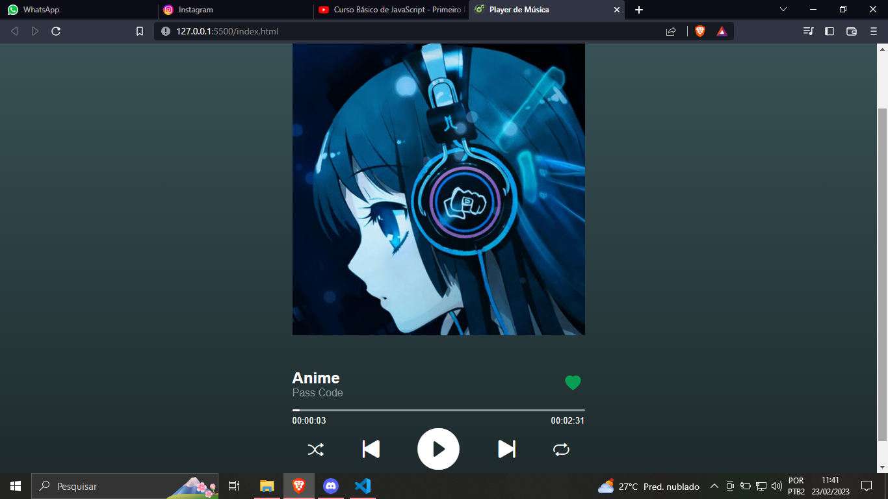

# Projeto-Web---Clone-do-Spotify
Meu segundo projeto web, baseado em um clone da interface do Spotify. Nesse projeto utilizei tecnologias HTML(estruturação e textos da página) , CSS (estilização, cores, designs e medidas) e JavaScript(interação com a página).
##
#Preview
##

